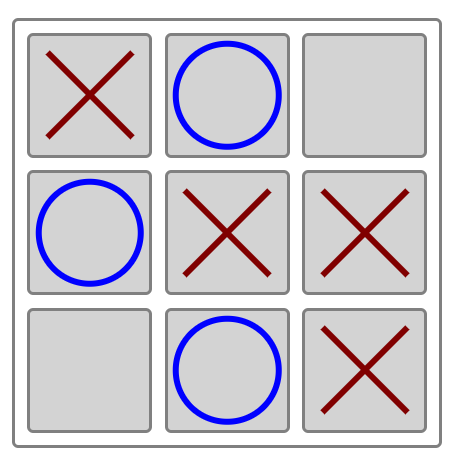
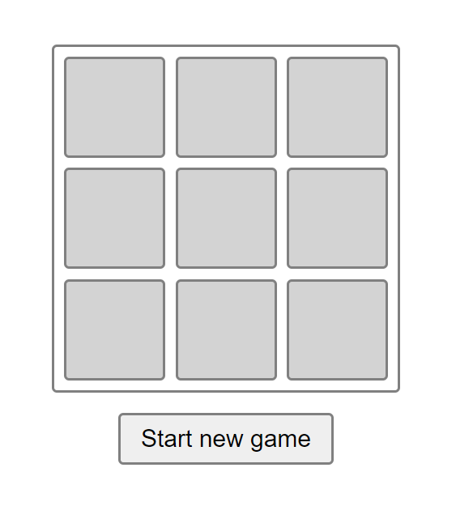
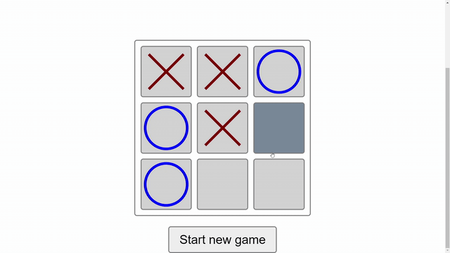
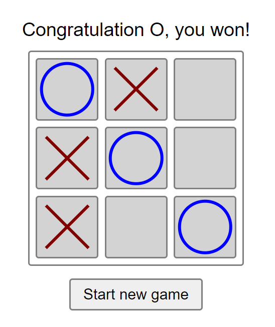
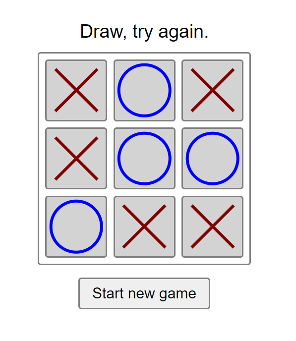

<br />
<p align="center">
  <a href="https://github.com/ewa-ilnicka/tictactoe">
    
  </a>

  <h3 align="center">Tic Tac Toe Game</h3>

  <p align="center">
    Popular game written to exercise programming skills.
  </p>
</p>


## Table of Contents

* [About the Project](#about-the-project)
  * [Built With](#built-with)
* [Getting Started](#getting-started)
  * [Prerequisites](#prerequisites)
  * [Installation](#installation)
* [Usage](#usage)
* [Roadmap](#roadmap)
* [Contributing](#contributing)
* [License](#license)
* [Contact](#contact)
* [Acknowledgements](#acknowledgements)


## About The Project

  

There are many great tic tac toe games available on GitHub, however, I decided to write one on my own to improve my programming skills. I wrote it while watching tutorial on YT made by [Samuraj Programowania](https://www.youtube.com/channel/UC6wlzVp-5TD5xfDwiohSDeg).

In this project:
* structure was made in HTML, styling in CSS and the script in Java Script;
* I'm using BEM's naming convention (at least I tried);
* tools used: Visual Studio Code and Git.

I'm still learning, so there might be some mistakes.


### Built With
To built this project I used:
* [HTML](https://en.wikipedia.org/wiki/HTML)
* [CSS](https://en.wikipedia.org/wiki/Cascading_Style_Sheets)
* [Java Script](https://en.wikipedia.org/wiki/JavaScript)


## Getting Started

To get a local copy up and running follow these simple example steps.

### Prerequisites

To open index.html you need any browser (altough I don't recommend Internet Explorer).

### Installation

1. Clone the repo
```sh
git clone https://github.com/your_username_/Project-Name.git
```
or download ZIP.

2. Open index.html with any browser.

3. Have fun playing the game with you friend :)


## Usage
[]()

Game can be played by two players. One player is represented by red X-symbol and other by blue O-symbol. Each player can win and nobody can win if it's a draw situation.

Below the board is a button which resets the board and starts a new game.





## Roadmap

What I am planning to do:

1. Game mode for player vs AI.
2. Few different designs including blackboard theme and some cyberpunk theme.
3. Points counting and score.


## Contact

Ewa Ilnicka - [ewailnicka.pl](http://www.ewailnicka.pl/) - ewa.h.ilnicka@gmail.com

Project Link: [https://github.com/ewa-ilnicka/tictactoe](https://github.com/ewa-ilnicka/tictactoe)


## Acknowledgements

* [README template](https://github.com/othneildrew/Best-README-Template)
* [Tic Tac toe tutorial](https://www.youtube.com/watch?v=ZQq5HybEboo)


